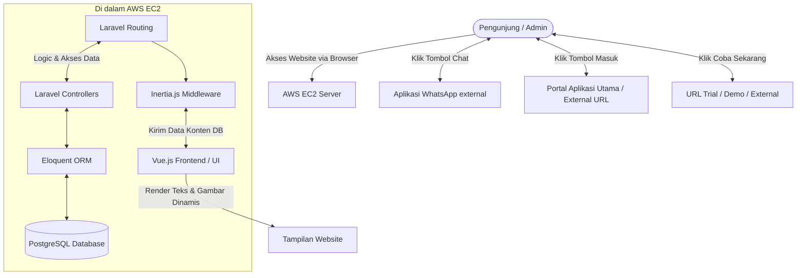
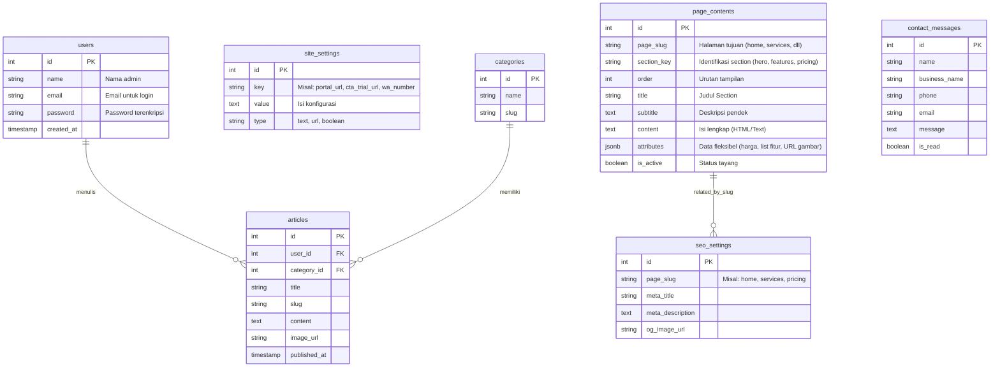

# PRD — Project Requirements Document

## 1. Overview
Aplikasi ini adalah website promosi (Company Profile & Landing Page) untuk produk SaaS POS yang sepenuhnya dinamis. Berbeda dengan website statis konvensional, platform ini dilengkapi dengan sistem **Global Content Manager** yang memungkinkan tim internal mengelola seluruh aspek visual dan teks website tanpa ketergantungan pada developer. Target pasar utamanya adalah pelaku UMKM di sektor F&B, Retail, dan Jasa. Website ini berfungsi sebagai "etalase digital" yang fleksibel, mampu menyesuaikan kampanye pemasaran, informasi harga, dan tautan aplikasi (Login & Trial) secara real-time melalui Admin Panel, serta mengoptimalkan SEO melalui metadata yang dapat dikonfigurasi.

## 2. Requirements
- **Waktu Pengerjaan:** Kurang dari 1 Bulan. Tingkat urgensi tinggi sehingga pengembangan harus efisien.
- **Target Audiens:** Pemilik bisnis UMKM (Makanan & Minuman, Toko Retail, dan Penyedia Jasa).
- **Desain & UX:** Profesional, bersih, dan modern. Mengambil referensi kualitas UI/UX seperti website promosi Moka POS. **Warna dasar website ditetapkan menggunakan kode warna #1e40af (Blue 800) untuk konsistensi branding.**
- **Manajemen Konten Global (Full CMS):** Seluruh elemen website (teks, gambar, ikon, warna, tata letak) harus dapat diubah melalui Admin Panel.
- **SEO Dinamis:** Metadata (Title, Description, OG Tags) untuk setiap halaman harus dapat dikelola oleh Admin.
- **Komunikasi:** Terintegrasi langsung dengan WhatsApp agar proses tanya jawab antara calon pelanggan dan *Customer Service* dapat dilakukan secara instan.
- **Infrastruktur:** Dapat di-deploy dan berjalan stabil di dalam *virtual server* AWS (layanan EC2).

## 3. Core Features
- **Global Content Manager:** Panel admin untuk mengedit konten pada seluruh halaman (Beranda, Layanan, Harga, Kontak, Blog) tanpa mengubah kode.
  - **Editable Elements:** Headline, Sub-headline, Paragraf, Tombol (CTA), Gambar Banner, Ikon Fitur, Daftar Harga, Testimoni, dan FAQ.
  - **Asset Management:** Upload dan ganti gambar atau ikon langsung dari dasbor.
- **SEO Manager:** Form khusus untuk mengisi Meta Title, Meta Description, dan Keywords untuk setiap halaman guna optimasi mesin pencari.
- **Halaman Layanan Dinamis:** Konten fitur untuk F&B, Retail, dan Jasa dapat ditambah, dikurangi, atau diubah urutannya oleh Admin.
- **Halaman Harga (Tiered Pricing) Editor:** Kemampuan untuk memperbarui nominal harga, nama paket, dan daftar fitur dalam tabel harga secara real-time.
- **Portal Link Manager:** Fitur pengaturan untuk mengubah URL tujuan tombol "Masuk/Login" (mengarah ke aplikasi POS utama) secara dinamis.
- **Header CTA Manager:** Fitur khusus untuk mengelola tombol "Coba Sekarang" di bagian header website, termasuk teks tombol dan URL tujuan yang dapat diubah via admin.
- **Blog / Artikel CMS:** Sistem publikasi konten edukasi bisnis dengan kategori dan tags yang dapat dikelola.
- **WhatsApp Integration:** Nomor tujuan WhatsApp dapat diubah melalui admin panel.
- **Contact Form & Leads Tracker:** Admin dapat melihat daftar potensial klien yang mengisi form kontak.
- **Footer & Header Config:** Pengaturan menu navigasi, link sosial media, hak cipta, dan tombol CTA utama di bagian header.

## 4. User Flow
**Perjalanan Pengunjung (Calon Pelanggan):**
1. Pengunjung masuk ke **Beranda** website (konten ditarik dinamis dari database).
2. Pengunjung melihat tombol **"Coba Sekarang"** di header dan mengkliknya (dialihkan ke URL trial yang dikelola admin).
3. Pengunjung mengklik menu **Layanan** untuk melihat fitur POS (konten fitur disesuaikan admin).
4. Pengunjung masuk ke halaman **Harga** untuk melihat paket berlangganan (harga terkini sesuai update admin).
5. Pengunjung klik tombol **"Masuk"** dan dialihkan ke URL Portal Aplikasi (URL dikelola dinamis oleh Admin).
6. Jika ada pertanyaan, pengunjung mengklik ikon **WhatsApp** atau mengisi form di halaman **Hubungi Kami**.
7. Pengunjung membaca tips bisnis di halaman **Blog**.

**Perjalanan Admin internal:**
1. Admin mengakses halaman *Login* tersembunyi (misal: `/admin/login`).
2. Masuk ke **Dashboard Admin**.
3. **Full Site Visual & Text Customization:**
   - Memilih menu **Kelola Halaman** (Home, Services, Pricing, dll).
   - Memilih section tertentu (misal: Hero Section, Feature List).
   - Mengubah teks, upload gambar baru, atau mengatur ulang urutan fitur.
   - Menyimpan perubahan dan melihat pratinjau (preview).
4. **Pengaturan SEO & Global:**
   - Mengisi Meta Title/Description untuk setiap halaman.
   - Mengupdate **URL Portal Aplikasi** dan **URL Tombol "Coba Sekarang"** di menu Pengaturan.
   - Mengupdate Nomor WhatsApp di menu Pengaturan.
5. **Konten & Leads:** Menulis artikel blog baru dan melihat pesan masuk dari formulir kontak.

## 5. Architecture
Aplikasi ini menggunakan pendekatan **Monolith Modern** dengan fokus pada **Dynamic Content Rendering**. Backend (Laravel) bertindak sebagai penyedia data konten yang disimpan di database, sedangkan Frontend (Vue.js) bertindak sebagai *renderer* yang menerima data tersebut melalui Inertia.js. Tidak ada teks *hard-coded* pada view frontend; semua string UI diambil dari database.

## 6. Database Schema
Untuk memfasilitasi kebutuhan website promosi yang sepenuhnya dinamis, skema database (menggunakan PostgreSQL) dirancang untuk menyimpan konten terstruktur per halaman dan section.

**Daftar Tabel:**
- `users`: Menyimpan data Admin yang bisa mengelola web.
- `page_contents`: Menyimpan konten terstruktur untuk setiap halaman dan section (Hero, Features, Pricing, dll). Menggunakan kolom JSONB untuk fleksibilitas atribut.
- `seo_settings`: Menyimpan metadata SEO untuk setiap URL/halaman.
- `categories`: Menyimpan kategori untuk artikel blog.
- `articles`: Menyimpan konten blog.
- `contact_messages`: Menyimpan data pesan dari pengunjung.
- `site_settings`: Menyimpan konfigurasi global (URL Portal, URL Trial, Nomor WA, Email, Social Links).

## 7. Tech Stack
Berdasarkan kebutuhan skalabilitas, kemudahan maintenance, serta instruksi yang ada, teknologi yang digunakan adalah:

- **Frontend:** **Vue.js** (Framework JavaScript yang interaktif) + **Tailwind CSS** (Untuk styling yang cepat, modern, dan rapi. **Konfigurasi warna kustom #1e40af akan diatur dalam tailwind.config.js untuk memastikan konsistensi branding**). Komponen Vue akan menerima *props* dari backend untuk merender konten dinamis.
- **Penghubung (Bridge):** **Inertia.js** (Digunakan untuk merender Vue langsung dari Laravel tanpa perlu membuat API publik terpisah, memungkinkan passing data konten database langsung ke komponen UI).
- **Backend:** **Laravel** (Framework server-side berbasis PHP yang sangat andal. Fitur Eloquent dan Accessors akan digunakan untuk mengelola data konten yang kompleks).
- **Database:** **PostgreSQL** (Database rasional berskala *enterprise*. Fitur **JSONB** akan dimanfaatkan pada tabel `page_contents` untuk menyimpan atribut section yang bervariasi tanpa perlu mengubah struktur tabel).
- **Deployment & Infrastruktur:** **AWS EC2** (Amazon Elastic Compute Cloud sebagai server/virtual machine untuk perilisian kode kurang dari 1 bulan agar kontrol sepenuhnya ada pada tangan developer).